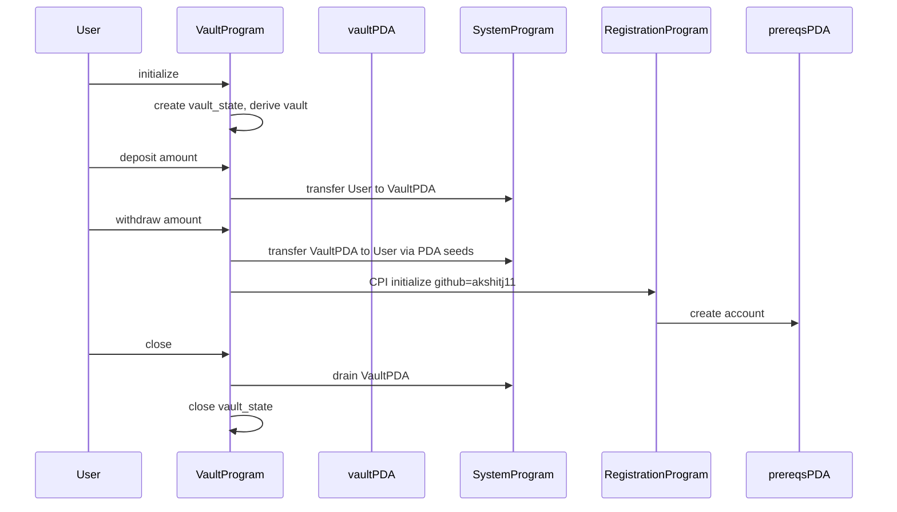

# Architecture

Programs on Solana are stateless. This vault splits state across two PDAs: `vault_state` holds bump seeds, `vault` holds lamports under the System Program with no data field. That split is why `withdraw` needs `CpiContext::new_with_signer`. The vault PDA signs the outbound transfer, then CPIs registration `initialize` before the instruction returns.

Registration lives at `TRBZyQHB3m68FGeVsqTK39Wm4xejadjVhP5MAZaKWDM`. The CPI writes `akshitj11` into a `prereqs` PDA seeded on the user wallet. A second `withdraw` on the same wallet would fail once that PDA exists.

| Account | Seeds | Owner |
|---|---|---|
| vault_state | `["state", user]` | vault program |
| vault | `["vault", vault_state]` | System Program |
| prereqs | `["prereqs", user]` | registration program |
