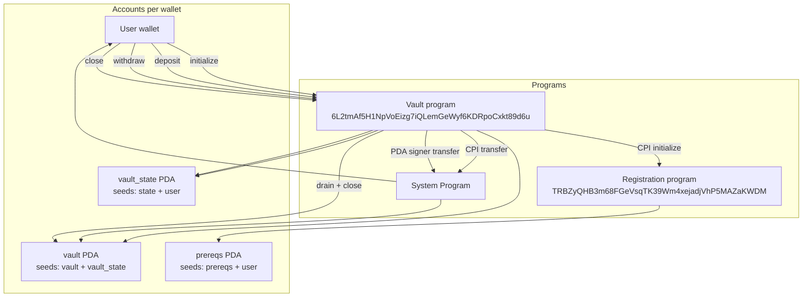
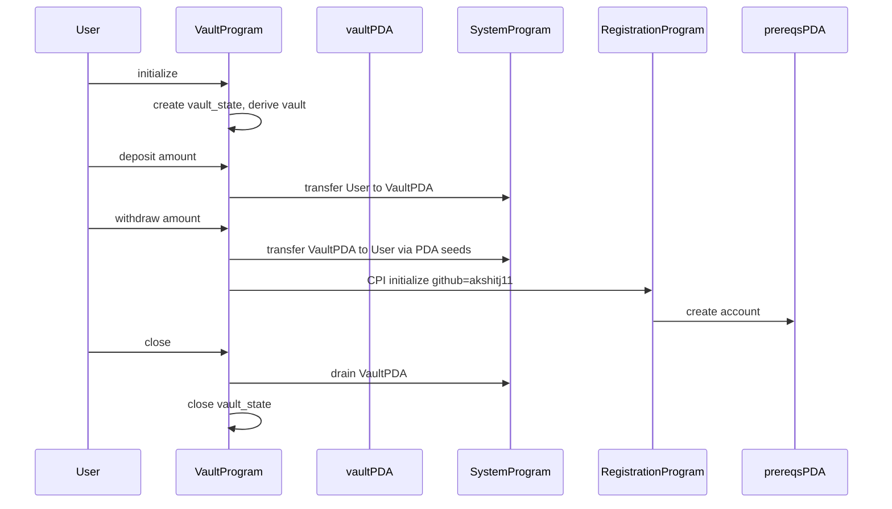

# Architecture

Withdraw moves SOL out of the vault PDA, then CPIs registration `initialize` in the same instruction. Evaluators check that enrollment runs through your deployed vault program, not a direct client call.

Each wallet owns two PDAs. `vault_state` stores bump seeds. `vault` is System-owned and holds lamports only, no custom data. Outbound transfers need PDA signer seeds because the vault has no private key. After the System transfer in `withdraw`, the vault program CPIs `TRBZyQHB3m68FGeVsqTK39Wm4xejadjVhP5MAZaKWDM` and writes `akshitj11` into the `prereqs` PDA. One registration per wallet.

| Account | Seeds | Owner |
|---|---|---|
| vault_state | `["state", user]` | vault program |
| vault | `["vault", vault_state]` | System Program |
| prereqs | `["prereqs", user]` | registration program |
